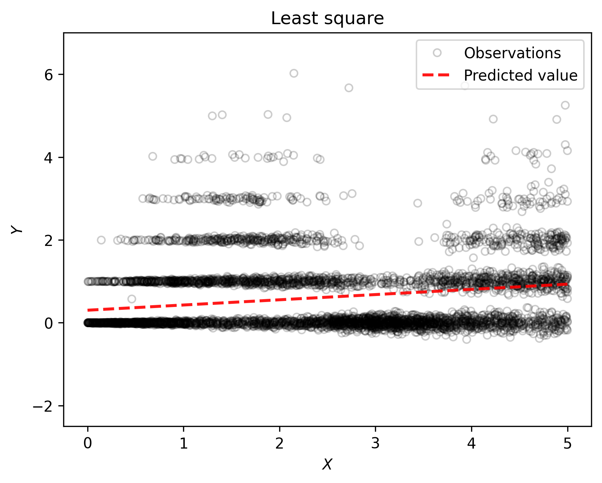

.. _Linear_regression:

=================
Linear Regression
=================

.. contents::
    :local:
    :depth: 2

Alphabate in the upper case is a matrix and in the lower case is a vector.

Introduction
============

Assume we have some :math:`n` training data points :math:`{(x_i, y_i)}_{i = 1}^{n}` that comes from an unknown/known distribution :math:`\mathcal{P}_{xy}`. Where, the :math:`x_i \in \mathcal{X} \in \mathbb{R}^d`
comes from the input distribution :math:`\mathcal{P}_{x}` and :math:`y_i \in \mathcal{Y} \in \mathbb{R}` comes from a conditioned distribution :math:`\mathcal{P}_{y/x}`. Now, we have a new data point :math:`x_{n+1}` and
we need to estimate the output for that point. We can think of an example that a hospital has some patients data. :math:`x_i` consists of some risk factors such as age, blood pressure, height, body weight, etc., for a patient and 
:math:`y_i` is a measure of kidney function(e.g., eGFR) for the same patient. Using the previous :math:`n` data points, our goal is to estimate the output of the new data point :math:`x_{n+1}`.

We can design an algorithm :math:`A \in \mathcal{A}` that takes the :math:`n` data points as an input and return a learned function :math:`f \in \mathcal{F}` such that :math:`f: \mathcal{X} \rightarrow \mathcal{Y}`. Now, if we know the learned :math:`f`, 
we can estimate the new output for the :math:`x_{n+1}`. There are different ways to learn the :math:`f` function. We will discuss some of them in this sections with python codes. We name linear regression because the predicted target value :math:`\hat{y}` is 
expected to be a linear combination of the features of :math:`x`. In mathematical notation, we can write :math:`\hat{y}` as follows:

.. math::

  \hat{y}(\theta, x) = \theta^{0} * x^0 + \theta^{1}*x^1 + \theta^{2} * x^2 +...+ \theta^{d} * x^d + b

Where, :math:`\theta = [\theta^0, \theta^1, \theta^2, ...., \theta^d]` is the parameters  and :math:`b` is the bias term. We can calculate the error/loss term as :math:`(\hat{y}_i - y_i)` for the :math:`x_i` data point. 
Our goal is to update the :math:`\theta` parameters in such a way that the error term gets minimized for the future data points such as :math:`x_{n+1}`.

Ordinary Least Squares
======================

Here, we try to solve a problem of the form as follows:

.. math::

  min_{\theta} ||X\theta - Y||_2^2

In the above equation :math:`\hat{y} = x \theta` for a data point and :math:`\hat{Y} = X \theta` for all :math:`n` data points. Where :math:`\theta \in \mathbb{R}^{d+1}`. The :math:`(+1)` comes due to including the bias term within :math:`\theta`.
For a new data point :math:`x_{n+1}`, we can estimate :math:`\hat{Y}_{n+1}` as :math:`x_{n+1} \theta`, but we do not know the :math:`\theta` parameter. One way we can
assume :math:`\theta` as random variables, but for a new point :math:`x_{n+1}`, we may have high error/loss :math:`(y_{n+1} - \hat{y}_{n+1})`. Lest us assume that we know :math:`y_{n+1}`.  
There are two ways to solve the above problem to get minimum error in the future data points. One is the exact solution and another one is the approximate solution.

Exact Solution
--------------
The loss for the :math:`n` data points is as follows:

.. math::
  L = ||X\theta - Y||_2^2

We need to find :math:`\theta` that minimizes the :math:`L` term.

.. math::

  L &= (X \theta - Y)^T(X \theta - Y)

    &=(\theta^T X^T - Y^T)(X \theta - Y)

    &= \theta^T X^T X \theta - \theta^T X^T Y - Y^T X \theta + Y^T Y
     
    &= \theta^T X^T X \theta - 2 Y^T X \theta + Y^T Y

  \frac{\partial L}{\partial X} &= 2 \theta^T X^T X - 2 Y^T X 

    &= 0

  \theta^T X^T X &= Y^T X

  X^T X \theta &= X^T Y

Now if :math:`d = n` and :math:`X` is an invertible matrix, the solution is as follows:

.. math::

  \theta =  X^{-1} Y

If :math:`d \neq n`, the solution is as follows:

.. math::
  \theta  = (X^T X)^{-1}X^T Y

In real case applications, it is hard to find :math:`d = n`. There are some drawbacks in the exact solution:
  1. :math:`X` is not invertible in most of the cases.
  2. If :math:`n` is very large, it is computationally very expensive to process all :math:`n` points.
Approximate Solution
--------------------

Please try the `code <https://colab.research.google.com/drive/1_NG11gNPu_UZj9_aH9-NvaQpFXLRg-Ez?usp=sharing>`_.